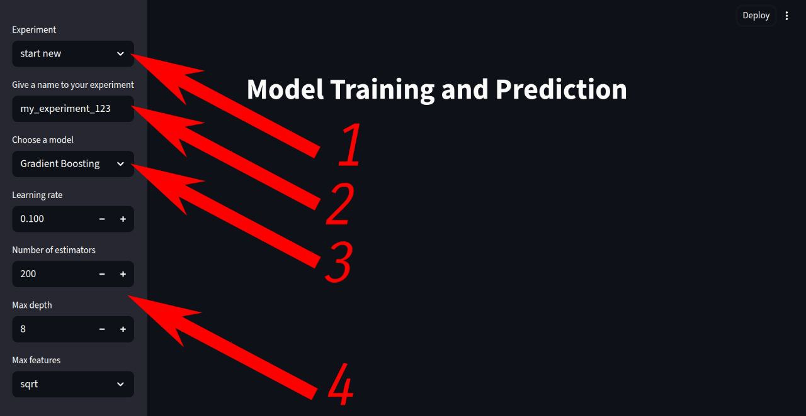
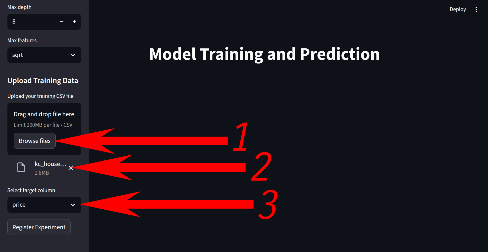
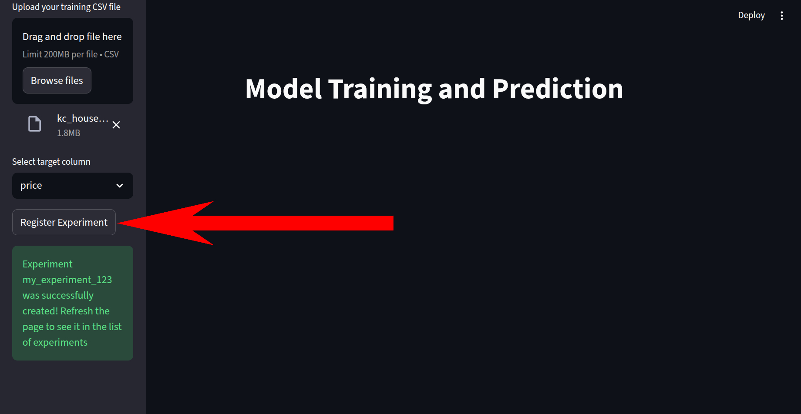
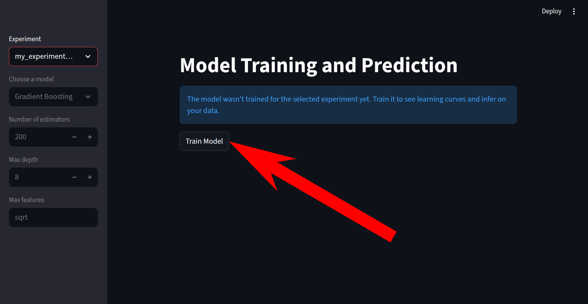
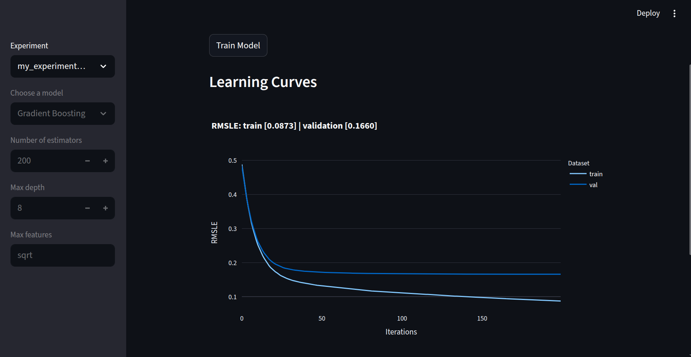
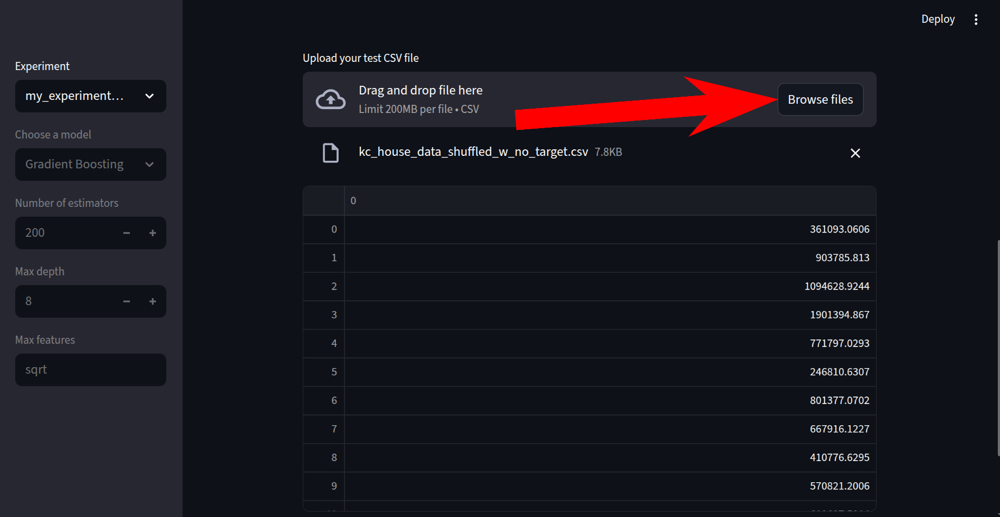

# ensemble-methods
Учебный проект: сайт с реализацией boosting и random forest


## Как запустить

### Предварительные требования

*   Установленный [Docker](https://www.docker.com/get-started/) и [Docker Compose](https://docs.docker.com/compose/install/).
```sudo
sudo apt install -y docker.io
sudo apt install -y docker-compose-plugin
```
### Быстрый старт (с готовых образов)

1.  Клонируйте репозиторий:
    ```bash
    git clone https://github.com/vladimir523/ensemble-methods.git
    cd ensemble-methods
    ```

2.  Запустите приложение:
    ```bash
    docker compose up
    ```

3.  Откройте в браузере:
    *   **Приложение:** [http://localhost:8501](http://localhost:8501)
    *   **Документация API:** [http://localhost:8000/docs](http://localhost:8000/docs)

### Запуск из исходного кода

1.  Клонируйте репозиторий:
    ```bash
    git clone https://github.com/vladimir523/ensemble-methods.git
    cd ensemble-methods
    ```

2.  Соберите и запустите контейнеры:
    ```bash
    docker compose up --build
    ```

3.  Откройте в браузере:
    *   **Приложение:** [http://localhost:8501](http://localhost:8501)
    *   **Документация API:** [http://localhost:8000/docs](http://localhost:8000/docs)


## Использование

Приложение предоставляет полный цикл работы с моделями машинного обучения.

### 1. Создание эксперимента

1.  В сайдбаре приложения выберите `start new`.
2.  Дайте эксперименту имя (например, `my_experiment_123`).
3.  Выберите тип модели: **Random Forest** или **Gradient Boosting**.
4.  Настройте гиперпараметры:
    *   **n_estimators:** Количество деревьев в ансамбле.
    *   **max_depth:** Максимальная глубина каждого дерева.
    *   **max_features:** Количество признаков, которые сравниваются в узле дерева.
    *   **learning_rate:** (только для Gradient Boosting) Коэффициент вклада новой модели в ансамбль при корректировке ошибки предыдущих деревьев.



### 2. Загрузка обучающих данных

1.  Нажмите **"Browse files"**.
2.  Выберите CSV-файл на вашем компьютере.
3.  После загрузки укажите **целевую колонку (target column)**: Имя колонки в данных, которую нужно предсказывать.



### 3. Регистрация эксперимента

1.  Нажмите кнопку **"Register Experiment"**.
2.  Система создаст папку для эксперимента и сохранит вашу конфигурацию.



### 4. Обучение модели

1.  Обновите страницу, вы увидите ваш эксперимент во вкладке **"Experiment"**.
2.  Если эксперимент еще не обучен, вы увидите сообщение с предложением обучить его.
3.  Нажмите кнопку **"Train Model"**.
4.  По завершении обучения модель и история сходимости будут сохранены.



### 5. Визуализация результатов

После успешного обучения под заголовком **"Learning Curves"** появится график.

*   График показывает, как менялась ошибка (RMSLE) на обучающей и валидационной выборках на каждой итерации.
*   Это позволяет оценить качество обучения и выявить переобучение.



### 6. Получение предсказаний

1.  Под заголовком **"Inference on your data"** появится блок для загрузки тестовых данных.
2.  Нажмите **"Browse files"** и выберите файл с данными, для которых нужно сделать предсказания.
3.  После загрузки приложение отобразит таблицу с предсказаниями модели.



## API

### Эндпоинты

*   `POST /register_experiment/`: Создать новый эксперимент.
*   `POST /upload_train_data/`: Загрузить обучающие данные.
*   `GET /experiment_config/{experiment_name}`: Получить конфигурацию эксперимента.
*   `GET /needs_training/?experiment_name={name}`: Проверить, обучена ли модель.
*   `POST /train_model/?experiment_name={name}`: Запустить обучение модели.
*   `GET /convergence_history/?experiment_name={name}`: Получить историю сходимости.
*   `POST /predict/?experiment_name={name}`: Сделать предсказания.

